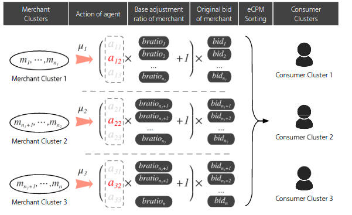

## Real-Time Bidding with Multi-Agent Reinforcement Learning in Display Advertising

### О чём статья

Реклама в режиме реального времени позволяет рекламодателям торговаться за каждый показ с целью привлечения пользователей. Конечной целью рекламодателей является максимизация дохода и окупаемости инвестиций (англ. ROI - return on investment). Для этого каждому рекламодателю нужно не только научиться оценивать релевантность рекламных объявлений интересам пользователей, но и выработать стратегию действий, учитывающую действия конкурирующих с ним рекламодателей. Для этого используются методы Reinforcement Learning.

### Решаемая проблема

При проектировании показа объявлений нужно учесть интересы всех рекламодателей. Когда рекламодателей много, задача значительно усложняется в связи с ростом вычислительных затрат. Существовавшие на тот момент методы имеели ряд ограничений. Например, они работали в предположении стационарности среды (environment).

### Background

Типичные онлайн-торги (англ. real-time bidding, далее - RTB) представляют собой аукцион второй цены. В теории для учёта интересов всех торгующихся рекламодателей нужно просто найти равновесие Нэша. Однако, на практике это сделать невозможно, так как равновесия зависят от слишком большого набора факторов.

Авторы статьи использовали теоретико-игровой подход, совместив его с multi-agent reinforcement learning (MARL). Преимущество этого подхода в том, что он рационален, так как каждый торгующийся агент стремится увеличить свой выигрыш (payoff), а также выбирать оптимальные действия в случае изменения стратегий агентов-оппонентов.

Эксперименты проводятся на платформе Taobao, где подавляющее число рекламодателей является продавцами товаров. Поэтому в статье соответствующие агенты называются продавцами.

**Формализм**

RTB формулируется в статье как марковская игра, состоящая из множества состояний `S` и набора действий `A_1`, ..., `A_n`, причём `A_i` - действие, которое выбирает агент с номером `i`.
Каждый агент `i=1,...,n` действует согласно своей политике . После выполнения действия `a_i` агент переходит в следующее состояние по функции перехода , где  - набор вероятностных распределений на `S`. Каждый агент получает `reward`, определяемый состоянием и действием всех агентов: `r_i : S x A_1 x ... A_n -> R`. Цель каждого агента - максимизировать свой `reward`: .

**Кластеризация**

В системе продавцы обозначаются `m_1, m_2, ..., m_n`, а покупатели - `c_1, c_2, ..., c_l`. Каждый аукцион запускается покупателем с фич-вектором `x`. В системе огромное число пользователей. Поэтому для снижения вычислительных затрат выполняется кластеризация продавцов на кластеры `M_1, ..., M_N` и покупателей на кластеры `C_1, ..., C_L`.

**Состояние**

Определены переменные `g_{i,j}=(cost_{i,j}, revenue_{i,j})`, где `cost_{i, j}` - цена, которую покупатель `j` заплатит продавцу `i`, `revenue_{i, j}` - выручка продавца от сделки. Все они объединяются в , что вместе с `x` (фич-вектором покупателя) формирует состояние `s=[g,x]`.

**Действие**

Продавец выбирает разные цены для разных кластеров покупателей. Для этого он берёт некоторую начальную цену `bid_k` и домножает её на коэффициент по формуле:

.

Напомним, что мы работаем не с отдельными продавцами, а с кластерами продавцов. Но нам хотелось бы варьировать коэффициент `alpha` в разисимости от того, с каким именно продавцом из кластера мы работаем. Для этого `alpha` для продавца k факторизуется следующим образом: `alpha = a_i x bratio_k`, где `a_i` - действие агента `i` (т.е. кластера `i`), считающееся с помощью нейросети, а `bratio_k` - коэффициент продавца. Здесь мы воспользовались предположением, что у любых двух продавцов из одного кластера векторы цен на товары линейно коллинеарны.

**Reward**

`Reward` определён на уровне агента как `ROI = revenue / cost`, где `cost` определяется по следующей формуле:

. 

### Решение
Авторы предлагают метод Distributed Coordinated Multi-Agent Bidding (DCMAB).

Идея - адоптировать deterministic policy gradient. Запишем Q-функцию следующим образом:

.

Выпишем уравнение Беллмана:

.

В случае детерминированной политики действие `a_i` выражается функцией от состояния:

.

Тогда уравнение Беллмана можно перезаписать:

.

Наконец, привлечём теоретико-игровой подход. Выпишем условия равновесия Нэша:

.

Тогда оптимальная политика ищется с использованием модифицированного градиентного спуска.

.

.

Формулы для multi-agent actor and critic выглядят следующим образом:

.

Тогда итоговый алгоритм запишется следующим образом:

.

### Эксперименты

Были рассмотрены несколько методов, лучшими из которых оказались DCMAB и DDPG, причём предложенный авторами данной статьи DCMAB оказался лучшим для 3 агентов из 4.

Кроме того, был проведён эксперимент с различными настройками агентов для регулирования степени кооперации/конкуренции между ними. Выяснилось, что посредством кооперации можно достичь гораздо более высокого суммарного выигрыша.

